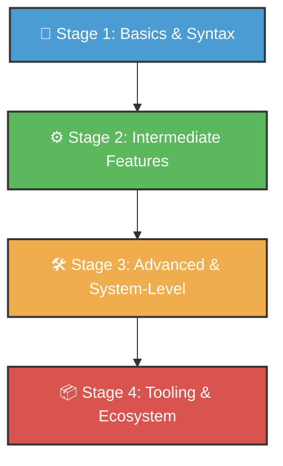

# 🐍 Python Learning Roadmap & Repository Index

Welcome to the ultimate Python reference and learning repository! This project serves as an interactive learning roadmap and code reference guide, tracking your progress from python basics up to system-level advanced topics and ecosystem tooling.

Each file in this repository is a complete, runnable script demonstrating core concepts, syntax, and best practices.

---

## 🗺️ Roadmap Overview

The repository is structured into four progressive learning stages:



---

## 📚 Table of Contents
1. [🚀 Stage 1: Basic Syntax & Concepts](#-stage-1-basic-syntax--concepts)
2. [⚙️ Stage 2: Intermediate & Modular Features](#-stage-2-intermediate--modular-features)
3. [🛠️ Stage 3: Advanced & System-Level Programming](#%EF%B8%8F-stage-3-advanced--system-level-programming)
4. [📦 Stage 4: Tooling & Ecosystem References](#-stage-4-tooling--ecosystem-references)
5. [💡 How to Use This Repository](#-how-to-use-this-repository)

---

## 🚀 Stage 1: Basic Syntax & Concepts

This stage covers the absolute essentials needed to start programming with Python. It covers comments, variables, primitive types, control flow, functions, collections, and basic regex.

| File | Focus / Concept | Core Syntax Preview |
| :--- | :--- | :--- |
| 📄 [Basic.py](./Basic.py) | Console I/O, Python history, pros & cons | `print("Hello World")`<br>`name = input("Enter name: ")` |
| 📄 [Comment.py](./Comment.py) | Single-line comments, docstrings (`__doc__`) | `# comment`<br>`"""docstring"""` |
| 📄 [Datatype.py](./Datatype.py) | Primitive types (int, float, str, bool, None) | `x: int = 10`<br>`y: float = 3.14` |
| 📄 [Variable.py](./Variable.py) | Variables, memory references (`id()`), basic string methods | `x = 10; print(id(x))`<br>`"name".upper()` |
| 📄 [Syntax_Variables.py](./Syntax_Variables.py) | Assignments, casting, and multi-input packing | `a, b = 1, 2`<br>`num1, num2 = map(int, input().split())` |
| 📄 [Operators.py](./Operators.py) | Math ops, division types, precedence, and Walrus operator | `10 // 3` (floor division)<br>`if (n := len(x)) > 3:` |
| 📄 [Control_Flow.py](./Control_Flow.py) | conditionals, loops, Ternary, `else` clause in loops | `val = "A" if cond else "B"`<br>`for x in range(3): ... else: ...` |
| 📄 [Functions.py](./Functions.py) | Functions, `*args`, `**kwargs`, lambda functions, recursion | `def f(a, *args, **kwargs): return a` |
| 📄 [Collections.py](./Collections.py) | Lists, Tuples, Dictionaries, Sets, slicing & set math | `nums[1:4]`, `x, y = y, x` (swap)<br>`set_a \| set_b` (union) |
| 📄 [Strings.py](./Strings.py) | String formatting, f-strings formatting | `f"{percentage:.2%}"`<br>`",".join(["a", "b"])` |
| 📄 [Regex.py](./Regex.py) | Regular expressions pattern matching | `import re`<br>`re.findall(r"\d+", "Price 100")` |

---

## ⚙️ Stage 2: Intermediate & Modular Features

This stage focuses on intermediate Python programming features, such as building reusable blocks, working with files, error handling, type hinting, and custom contexts.

| File | Focus / Concept | Core Syntax Preview |
| :--- | :--- | :--- |
| 📄 [Comprehensions.py](./Comprehensions.py) | List, Dict, Set comprehensions, generator expressions | `squares = [x**2 for x in range(5)]`<br>`gen = (x**2 for x in range(10))` |
| 📄 [Modules_Libraries.py](./Modules_Libraries.py) | Standard libraries (`math`, `random`, `os`), custom packages | `import math as m`<br>`__init__.py` module declaration |
| 📄 [File_Handling.py](./File_Handling.py) | File reading/writing, JSON parsing, modern `pathlib` usage | `from pathlib import Path`<br>`Path("t.txt").write_text("Hi")` |
| 📄 [Exception_Handling.py](./Exception_Handling.py) | Catching multiple exceptions, custom errors, `try/except/else/finally` | `try: ... except (ValueError, TypeError):` |
| 📄 [Iterators_Generators_Decorators.py](./Iterators_Generators_Decorators.py) | Iterators (`__iter__`), generators (`yield`), decorators, `itertools` | `yield val`<br>`@my_decorator` wrapping |
| 📄 [Closures_Lambdas.py](./Closures_Lambdas.py) | Closures, scope caching, functional tools (`map`, `filter`, `reduce`) | `def outer(x): return lambda y: x * y` |
| 📄 [Type_Hints.py](./Type_Hints.py) | PEP 484 type annotations, `Union`, `Optional`, static checkers | `def greet(name: str) -> Optional[str]:` |
| 📄 [Context_Managers.py](./Context_Managers.py) | Custom context managers (`__enter__`/`__exit__`), `@contextmanager` | `with custom_resource() as res:` |

---

## 🛠️ Stage 3: Advanced & System-Level Programming

For deep dives into memory management, OOP structure, multi-threading, asyncio, profiling, and interfacing with C libraries.

| File | Focus / Concept | Core Syntax Preview |
| :--- | :--- | :--- |
| 📄 [OOP.py](./OOP.py) | Classes, multiple inheritance, operator overloading, polymorphism | `class Child(Parent1, Parent2):`<br>`def __add__(self, other):` |
| 📄 [Metaclasses_Descriptors.py](./Metaclasses_Descriptors.py) | Custom metaclasses (`type`), descriptor protocol (`__get__`/`__set__`) | `class Meta(type):`<br>`class Descriptor:` |
| 📄 [Dataclasses.py](./Dataclasses.py) | Auto-generated standard class boilerplate, `slots` usage | `@dataclass(slots=True)`<br>`history: list = field(default_factory=list)` |
| 📄 [Async_IO.py](./Async_IO.py) | Asynchronous task execution, coroutines, `async/await`, `asyncio` | `await asyncio.gather(task1(), task2())` |
| 📄 [Multithreading.py](./Multithreading.py) | Threading, GIL limits, Locks, Semaphores | `import threading; lock = threading.Lock()` |
| 📄 [Concurrency_Multiprocessing.py](./Concurrency_Multiprocessing.py) | OS Processes, bypassing the GIL, Process Pool mapping | `with multiprocessing.Pool() as pool:` |
| 📄 [C_Extensions.py](./C_Extensions.py) | Interfacing with C libraries using `ctypes` and Cython references | `import ctypes`<br>`libc = ctypes.CDLL("libc.so.6")` |
| 📄 [Memory_GIL_313.py](./Memory_GIL_313.py) | Reference counts (`sys.getrefcount`), cyclical GC, Python 3.13 free-threaded no-GIL architecture | `import gc; gc.collect()` |

---

## 📦 Stage 4: Tooling & Ecosystem References

This section lists python tools, quality checkers, testing frameworks, configurations, design patterns, and popular package libraries.

| File | Focus / Concept | Core Tools / Frameworks |
| :--- | :--- | :--- |
| 📄 [Environments_Packaging.py](./Environments_Packaging.py) | Virtual environments, PyPI packaging setup | `venv`, `poetry`, `uv`, `pyenv`, `pyproject.toml` |
| 📄 [Testing.py](./Testing.py) | Unit testing, verification strategies, mock testing | `pytest`, `unittest`, mocks, test fixtures |
| 📄 [Code_Quality.py](./Code_Quality.py) | Formatters, linters, pre-commit configuration | `Black`, `Ruff`, `pre-commit` |
| 📄 [Logging_Debugging.py](./Logging_Debugging.py) | Logging configurations, severity levels, line breakpoints | `logging`, `breakpoint()` (pdb debugger) |
| 📄 [Profiling.py](./Profiling.py) | Time and memory execution diagnostics, bottlenecks | `timeit`, `cProfile`, memory profiling |
| 📄 [Scripting_Automation.py](./Scripting_Automation.py) | Subprocesses, developing terminal commands | `subprocess.run()`, `click`, `typer` |
| 📄 [Ecosystem_Frameworks.py](./Ecosystem_Frameworks.py) | Quick reference for popular Python packages | **Web**: FastAPI, Django, Flask<br>**ORMs**: SQLAlchemy<br>**Queues**: Celery<br>**Data/ML**: NumPy, Pandas, PyTorch |
| 📄 [Design_Patterns.py](./Design_Patterns.py) | Common structural, creational, and behavioral design patterns | Factory pattern, Observer pattern, Singleton pattern |

---

## 💡 How to Use This Repository

### 1. Prerequisites
Ensure you have Python 3.10+ installed. Python 3.13+ is recommended for experimenting with the free-threaded features inside `Memory_GIL_313.py`.

### 2. Running the Scripts
You can run any script individually in your terminal. For example, to run the Control Flow scripts:
```bash
python Control_Flow.py
```

### 3. Deep-Dive Documentation
For a comprehensive syntax overview mapped directly to these files, please refer to the main repository index cheat sheet:
* 📄 **[Python Cheat Sheet](./Python_CheatSheet.md)**

---

*Happy Coding! 🐍*
